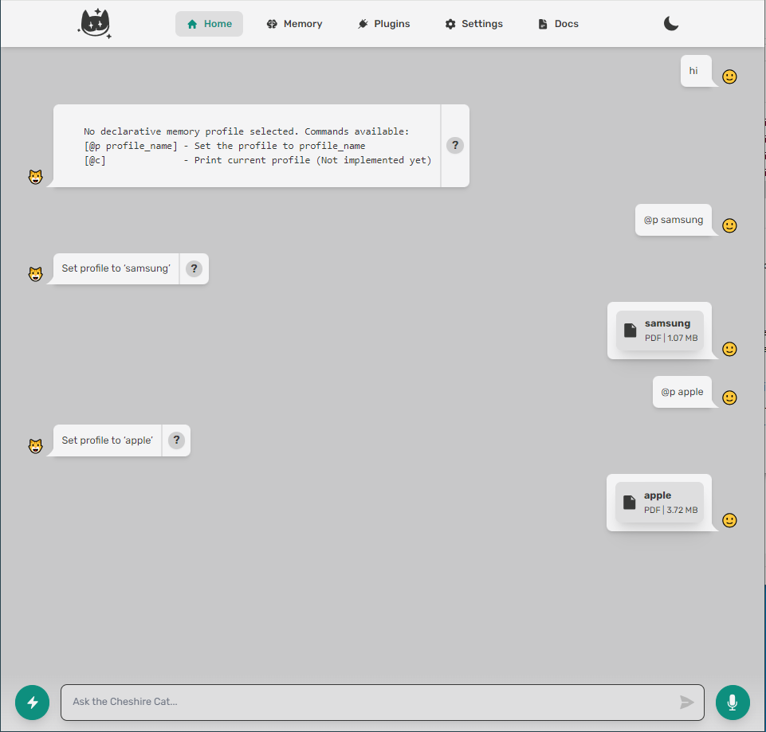
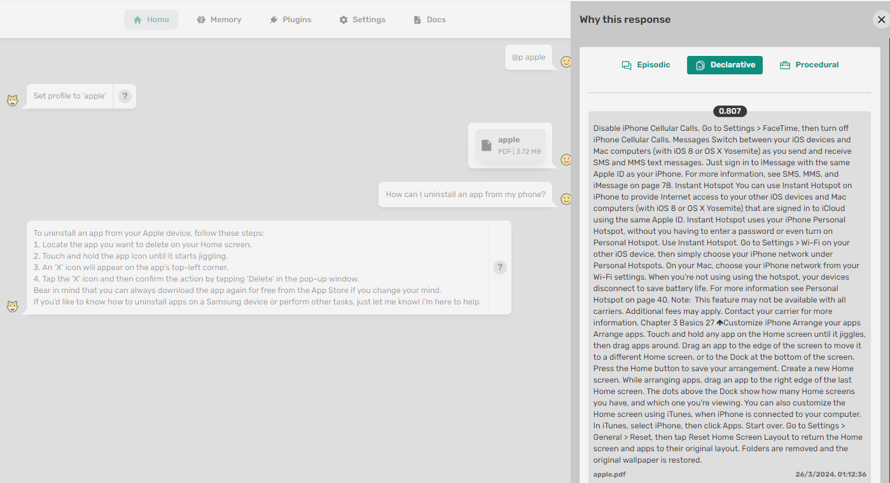
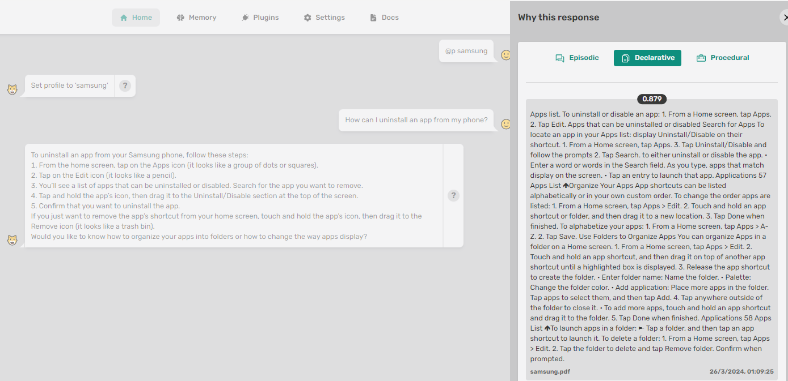

# Declarative Memory Profiling

[](https://)


Loosely inspired by Quivr's "[brain](https://docs.quivr.app/getting-started/brain)" concept. The plugin allows you to profile loading and retrieval into and from declarative memory using a profile set in the working memory

## Usage


1. Install and activate the plugin
2. Activate a profile for the session with the `command`:
```python
@p profile_name
```

> Two manuals with two different profiles have been uploaded


4. Load documents into the selected profile and query the profiled memory



> for the same question we receive the response profiled according to the selected profile


## Todo

 - [ ] Remove profile management commands from history
 - [ ] Create two more layers regarding memory profiling (public/global, private/user)
 - [ ] Allow profile forcing/selection via additional parameter in user message

> **Important**
> A new release of your plugin is triggered every time you set a new `version` in the `plugin.json` file.
> Please, remember to set it correctly every time you want to release an update.

